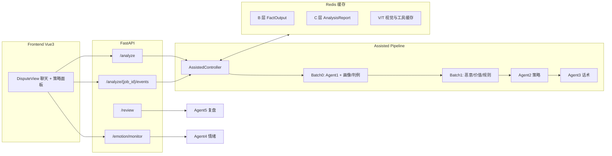

# 裁量台 · 电商纠纷 Multi-Agent 决策系统

面向淘宝/天猫等平台的**商家售后纠纷辅助决策**系统。商家在千牛等场景处理退款、质量争议、七天无理由退货时，常面临三类困境：**不懂平台规则边界**、**举证与话术无效**、**情绪化让步或对抗**。本项目用 Multi-Agent 串联事实提炼、策略推理与话术生成，在页面一键分析后输出可执行的结构化建议。

> 当前交付形态为**辅助模式（Assisted）**：AI 给出事实摘要、处置策略与对买家话术，由商家操控发送；智能自动化模式尚在实现中。

## 演示

[demo.mp4](assets/demo.mp4)

---

## 核心能力


| 能力                 | 说明                               |
| ------------------ | -------------------------------- |
| **一键纠纷分析**         | 上传聊天、订单信息与举证图，返回完整分析报告           |
| **事实层（Agent1）**    | 多模态理解举证图、物流与聊天冲突检测、证据质量评估、规则检索计划 |
| **策略层（Agent2）**    | 恶意买家识别、客户价值权衡、平台规则匹配、处置方向与补偿契约   |
| **话术层（Agent3）**    | 按策略阶段生成对买家回复，含举证引导、规则解释、金额和解等模式  |
| **卖家情绪预警（Agent4）** | 发送前检测卖家措辞过激，旁路 API，不阻断主分析        |
| **关单复盘（Agent5）**   | 纠纷结束后沉淀结构化判例，可异步写入 MySQL         |
| **评测体系**           | 情景树 + 硬断言 + LLM Judge，支撑回归与迭代    |


---

## 系统架构




### 主链路（Agent1 → Agent2 → Agent3）

1. **创建任务**：`POST /analyze` 将材料落为幂等 `job_id`，立即返回；浏览器保存该 ID。
2. **异步执行**：Celery worker 合并材料、命中 B/C 缓存后依次运行 Agent1、Agent2、Agent3。
3. **事件持久化**：worker 将阶段进度、局部结果和最终报告按递增序号写入 MySQL。
4. **SSE 补发**：前端订阅任务事件；断线后 EventSource 携带 `Last-Event-ID` 自动重连，服务端只补发缺失事件。
5. **结果兜底**：`GET /analyze/{job_id}` 返回任务状态与最终 `AnalysisReport`，完成结果不依赖长连接留存。

### 数据契约

全链路输入输出由根目录 `[schemas.py](schemas.py)` 统一定义（`FactOutput`、`StrategyOutput`、`ScriptOutput`、`AnalysisReport` 等），Agent 间禁止私自扩展字段。

### 失效与降级

- **LLM / 视觉偶发失败**：各 Agent 内部 fallback，链路尽量跑完，报告质量下降。
- **阶段硬异常**：当前阶段 `pipeline_error`，`/analyze` 返回 **500**，不返回半成品报告。
- **Agent4 / Agent5**：独立 API，失败不影响主分析。

---

## 技术栈


| 层级  | 技术                                          |
| --- | ------------------------------------------- |
| 后端  | Python 3.11 · FastAPI · SQLAlchemy · Celery |
| 前端  | Vue 3 · Vite · Element Plus                 |
| 存储  | MySQL（商家配置、买家画像、判例）· Redis（缓存与任务队列）         |
| LLM | 小米 MiMo（OpenAI 兼容 `chat/completions`）       |
| 视觉  | 阿里云百炼 DashScope 多模态 API                     |
| 评测  | YAML 情景树 · pytest · Judge 评分模型              |


---

## 快速开始

### 环境要求

- Python 3.11+
- Node.js 18+
- MySQL 8+
- Redis 6+（本地开发可用 `scripts/ensure-redis.ps1` / `ensure-redis.sh` 拉起）

### 1. 配置

```bash
cp .env.example .env
# 填写 VISION_API_KEY、LLM_API_KEY、DB_* 等
```

未配置 Redis 缓存时可设 `ENABLE_REDIS_CACHE=0`（默认），仍可运行，仅无跨请求缓存。

### 2. 安装依赖

```bash
# 后端
python -m venv .venv
.venv\Scripts\activate          # Windows
# source .venv/bin/activate     # Linux/macOS
pip install -r backend/requirements.txt

# 前端
cd frontend && npm install
```

### 3. 启动（Windows）

```powershell
.\scripts\start.ps1
```

- 后端：[http://127.0.0.1:8000](http://127.0.0.1:8000)
- 前端：[http://127.0.0.1:5173](http://127.0.0.1:5173)
- 健康检查：`GET /health`

Linux/macOS 可使用 `scripts/start.sh`。

### 4. 规则索引（可选）

规则匹配依赖 `data/rule_match_lexicon.json`。可用脚本从规则文档构建：

```bash
python scripts/build_rule_match_lexicon.py
```

---

## API 概览


| 方法               | 路径                              | 说明                                    |
| ---------------- | ------------------------------- | ------------------------------------- |
| `POST`           | `/analyze`                      | 创建或复用异步分析任务，返回 `job_id`     |
| `GET`            | `/analyze/{job_id}`             | 查询任务状态与最终 `AnalysisReport` |
| `GET`            | `/analyze/{job_id}/events`      | SSE 阶段事件订阅，支持 `Last-Event-ID` 补发 |
| `POST`           | `/analyze/{job_id}/cancel`      | 请求协作式取消任务 |
| `POST`           | `/emotion/monitor`              | 卖家情绪检测与预警                             |
| `POST`           | `/review`                       | 关单复盘，可选写入判例库                          |
| `GET/PUT`        | `/merchants/{id}/config`        | 商家模式与阈值配置                             |
| `GET/PUT/DELETE` | `/merchants/{id}/buyers/{hash}` | 买家画像 CRUD                             |
| `GET`            | `/health`                       | 服务健康检查                                |


### `/analyze` 请求示例

```json
{
  "dispute_id": "D-20260001",
  "merchant_id": "M001",
  "messages": [
    { "role": "buyer", "content": "衣服袖子有破洞，要求退款" },
    { "role": "merchant", "content": "您好，我先核实一下" }
  ],
  "order_id": "ORDER10001",
  "order_amount": 129.0,
  "buyer_id": "buyer_hash_xxx",
  "image_urls": ["https://example.com/evidence.jpg"],
  "product_category_slug": "phone",
  "platform_service_tags": ["七天无理由"]
}
```

响应包含 `facts`、`strategy`（含 `disposition`、`matched_rules` 摘要）、`scripts`（含 `script`、`response_mode`）等字段。

---

## 评测体系

`eval/` 目录提供情景评测流水线：

- **情景树**：`eval/content/scenarios/eval_tree_*.yaml`（恶意、客户价值、规则举证、判例、混合、多轮等维度）
- **硬断言**：对 `disposition`、禁忌输出、关键字段做确定性校验
- **Judge**：`eval/pipeline/judge_cases.py` 调用 LLM 按多维度 rubric 打分

本地跑批产物默认写入 `eval/output/`

```bash
# 示例：跑指定情景树（需配置 JUDGE_LLM_MODEL 等）
python -m eval.pipeline.run_batch_eval --tree eval/content/scenarios/eval_tree_ma.yaml
```

---

## 项目结构

```
├── backend/
│   ├── agents/          # Agent1～5 业务逻辑
│   ├── controllers/     # 辅助模式 / 情绪 / 复盘编排
│   ├── pipeline/      # 批处理（dispute_batch）
│   ├── routers/       # FastAPI 路由
│   ├── tools/         # LLM 客户端、规则匹配、平台 API
│   ├── cache/         # Redis 三层缓存
│   └── tasks/         # Celery 异步任务
├── frontend/            # Vue3 商家工作台
├── eval/              # 情景、Judge、跑批流水线
├── data/              # 规则索引、信号词表、Mock 举证图
├── schemas.py         # 全局数据契约
├── tests/             # 单元 / 集成 / E2E 测试
└── scripts/           # 启动与数据入库脚本
```

---

## 测试

```bash
# 单元与集成（不含 E2E 服务拉起）
pytest tests/ --ignore=tests/eval -k "not e2e"

# 分析 E2E（需先启动 Redis 和 Celery worker；PowerShell）
$env:RUN_E2E_ANALYSIS=1; pytest tests/test_e2e_api.py
```

---

## 配置说明

主要环境变量见 `[.env.example](.env.example)`：


| 变量                                                     | 用途                    |
| ------------------------------------------------------ | --------------------- |
| `VISION_API_*`                                         | Agent1 图片分析（百炼）       |
| `LLM_API_*`                                            | 各 Agent 与 Judge 的文本模型 |
| `AGENT*_LLM_MODEL`                                     | 分 Agent 模型名           |
| `LLM_HTTP_*`                                           | LLM 超时、进程内连接池与重试策略 |
| `DB_*`                                                 | MySQL 连接              |
| `REDIS_URL` / `REDIS_CACHE_URL`                        | Celery 用 db0；纠纷缓存用 db1 |
| `ENABLE_REDIS_CACHE` / `AGENT_CACHE_VERSION`           | 缓存开关与 B/C 版本后缀        |
| `MATERIALS/FACTS/REPORT/VISION/PROFILE/CASES_*_TTL`    | 各层固定 TTL（秒）            |
| `ENABLE_ANALYZE_STREAM` / `VITE_ENABLE_ANALYZE_STREAM` | 流式分析开关                |

`LLM_HTTP_MAX_ATTEMPTS` 包含首次请求。客户端只重试网络异常、429 和 5xx；429
优先遵守上游的 `Retry-After`，其他瞬时失败使用带随机抖动的指数退避。连接池只在
单个 FastAPI/Celery 进程内生效，跨 worker 的全局配额控制依赖后续 Redis 协调。
流式响应已经输出任一文本分片后不会自动重试，避免重复推送；浏览器侧断线恢复由
任务事件持久化与 SSE `Last-Event-ID` 处理。

Redis 缓存 key 统一为 `ea:v2:{layer}:{merchant_hash}:...`，业务标识经 SHA-256
截断后写入，不暴露原始商家/纠纷/订单号。读命中不续期。默认 TTL：材料/事实/报告
24h，视觉 7 天，画像与判例 6h，空判例 60s，物流 15 分钟。缓存 key 哈希与 Job
幂等键（完整 SHA-256 + MySQL 唯一约束）用途不同，不可混谈。

分析任务使用 Redis db0 作为 Celery broker，但任务状态、报告和 SSE 事件以 MySQL
为事实源。worker 配置 late ACK、单条预取、软/硬超时；`visibility_timeout` 必须大于
硬超时和 Job 租约。消息可能至少一次投递，MySQL 的 `queued → running` 领取状态机
负责吸收重复消息；Celery result backend 只供运维查看，不供前端恢复任务。


---

## 说明与边界

- **平台对接**：物流、订单等通过 `platform_api` 抽象；生产需配置千牛开放平台密钥。
- **规则库**：匹配依赖 `rule_match_lexicon.json` 与 MySQL 规则表，需按平台文档维护。
- **文档**：详细设计文档在本地 `docs/`（未纳入公开仓库）；本 README 以当前代码为准。

---

## License

MIT