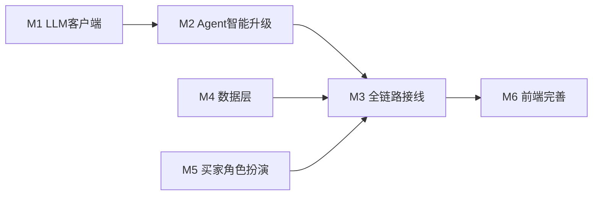

# v1.0.0 辅助模式升级计划

> **用途**：Agent 与人类可按表推进；完成后请在文末「任务状态」表更新 `状态` 与 `备注`。  
> **范围**：不含智能模式；不含平台拉取工单/订单等真实平台对接；淘宝规则抓取仅限规则中心公开页。  
> **关联文档**：需求见 [Prd.md](Prd.md)，文档索引见 [agent.md](agent.md)。

---

## 1. 现状诊断（缺口汇总）

- 所有 Agent 无 LLM：`.env.example` 已预留 `LLM_API_ENDPOINT` / `LLM_API_KEY`、各 `AGENT*_LLM_MODEL`，代码层未实现。
- Agent4：`emotion_alert` 在辅助控制器中固定为 `None`，侧栏情绪区不灵。
- Agent5：无 HTTP 触发入口，复盘难以写入 `dispute_cases`，判例检索长期 Mock。
- 买家画像：`query_buyer_profile` 多为内存 Mock；`buyer_profiles` 表未充分使用。
- 判例：`search_similar_cases` 固定候选池；`dispute_cases` 数据少。
- 规则库：`data/dispute_rules.json` 条数少且自造，需改为淘宝规则中心来源可追溯。
- 前端：FactCard 未展示部分 `FactOutput` 字段；ScriptCard 未展示 `usage_tip`。
- 自测：缺「用户扮演买家」的显式入口（当前仅能用消息 `role` 人工模拟，体验不便）。

---

## 2. 模块说明

### M1 — LLM 共用客户端

- **文件**：`backend/tools/llm_client.py`（新建）。
- **要点**：封装 `LLM_API_ENDPOINT` / `LLM_API_KEY` 的 HTTP 调用；`chat_completion(messages, model_env_key, temperature)`；未配置端点时返回 `None` 或约定信号，由调用方 fallback；错误信息中文。

### M2 — Agent 智能升级（LLM + 规则兜底）

| 子项          | 文件                                          | 要点                                                           |
| ----------- | ------------------------------------------- | ------------------------------------------------------------ |
| M2-1 Agent1 | `backend/agents/agent1/fact_extractor.py`   | `_llm_extract_facts(text)`，与规则/关键词结果合并，LLM 优先、规则兜底。          |
| M2-2 Agent2 | `backend/agents/agent2/strategist.py`       | 规则加权**不改决策逻辑**；`_llm_generate_reasoning()` 生成可读 `reasoning`。 |
| M2-3 Agent3 | `backend/agents/agent3/script_generator.py` | LLM 生成三版话术；`AGENT3_LLM_MODEL`；失败走模板。                         |
| M2-4 Agent5 | `backend/agents/agent5/reviewer.py`         | `lesson_text` 等由 LLM 生成；`AGENT5_LLM_MODEL`；失败走现有规则拼装。        |

**依赖**：M1。

### M3 — 全链路接线

| 子项          | 文件                                                                                  | 要点                                                                                                         |
| ----------- | ----------------------------------------------------------------------------------- | ---------------------------------------------------------------------------------------------------------- |
| M3-1 Agent4 | `backend/controllers/assisted_controller.py`                                        | 串联 Agent4 `monitor`，填充 `AnalysisReport.emotion_alert`。                                                     |
| M3-2 复盘闭环   | `backend/routers/disputes.py`（新建）、`backend/main.py` 注册、`frontend/.../ChatPanel.vue` | `POST /disputes/{dispute_id}/close`，`merchant_id` + `outcome`（win/lose/settle），触发 `async_review`；前端「结束纠纷」。 |

**依赖**：M2；M3-2 还依赖判例写入路径（与 M4-3 衔接）。

### M4 — 数据层

| 子项        | 文件                                                               | 要点                                                                                                                             |
| --------- | ---------------------------------------------------------------- | ------------------------------------------------------------------------------------------------------------------------------ |
| M4-1 淘宝规则 | `scripts/fetch_taobao_rules.py`（新建）、`data/dispute_rules.json`    | 抓取 `rule.taobao.com` 公开规则，解析为现有规则 JSON 结构；`platform_ref` 存原文链接或编号；建议 `--dry-run`；目标 50+ 条；`conditions` 与 `FactOutput` 对齐需人工抽查。 |
| M4-2 画像   | `backend/tools/agent2_tools.py`、`scripts/seed_buyer_profiles.py` | 画像优先读 `buyer_profiles`；种子脚本写入约 10 条典型画像。                                                                                       |
| M4-3 判例检索 | `backend/tools/agent2_tools.py`                                  | `search_similar_cases` 查 `dispute_cases`（如关键词匹配 `case_summary`）；表空则保留原 Mock 池。                                                 |

### M5 — 买家角色扮演（人工自测）

- **文件**：`frontend/src/components/chat/ChatPanel.vue`、`frontend/src/composables/useDispute.js`。
- **要点**：输入区「商家 / 买家」切换，发送消息对应 `role`；由用户自行输入扮演买家，不设预置场景下拉。
- **依赖**：无；建议最先做以便联调。

### M6 — 前端展示补全

- **M6-1**：`frontend/src/components/strategy/FactCard.vue` — 补充 `goods_received`、`defect_location`、物流相关展示（与 `FactOutput` / 现有字段一致）。
- **M6-2**：`frontend/src/components/strategy/ScriptCard.vue` — 展示 `usage_tip`。

---

## 3. 推进顺序与依赖

- M1、M4-1、M4-2、M5 可并行。
- M2 依赖 M1；M3 依赖 M2 与（建议）M5 自测就绪；M4-3 在已有复盘写入数据后更有意义。
- 推荐顺序：**M5 → M1/M4-1/M4-2 并行 → M2 → M3 → M4-3 → M6**。

---

## 4. 计划总表（工作分解）

| 编号   | 模块         | 核心任务                | 涉及文件                                                             | 依赖    | 预估工作量 | 验收标准               |
| ---- | ---------- | ------------------- | ---------------------------------------------------------------- | ----- | ----- | ------------------ |
| M1   | LLM 共用客户端  | 封装 LLM HTTP、降级      | `backend/tools/llm_client.py`                                    | 无     | 小     | 配置全则可用；缺省不拖垮链路     |
| M2-1 | Agent1     | LLM 辅助事实提取          | `backend/agents/agent1/fact_extractor.py`                        | M1    | 中     | 有/无 LLM 行为可预期      |
| M2-2 | Agent2     | LLM 生成 reasoning    | `backend/agents/agent2/strategist.py`                            | M1    | 小     | `reasoning` 可读、贴规则 |
| M2-3 | Agent3     | LLM 三版话术            | `backend/agents/agent3/script_generator.py`                      | M1    | 中     | 三版差异明显；模板兜底        |
| M2-4 | Agent5     | LLM 复盘摘要            | `backend/agents/agent5/reviewer.py`                              | M1    | 小     | 摘要自然；规则兜底          |
| M3-1 | Agent4 接线  | `emotion_alert` 入库路 | `backend/controllers/assisted_controller.py`                     | M2    | 小     | `/analyze` 带情绪结构   |
| M3-2 | 复盘 API     | 结束纠纷 → Celery       | `backend/routers/disputes.py` 等、`ChatPanel.vue`                  | M2、M4 | 中     | DB 有判例记录           |
| M4-1 | 淘宝规则       | 抓取并生成 JSON          | `scripts/fetch_taobao_rules.py`、`data/dispute_rules.json`        | 无     | 大     | 条数与溯源字段满足约定        |
| M4-2 | 画像落库       | DB 优先 + seed        | `backend/tools/agent2_tools.py`、`scripts/seed_buyer_profiles.py` | 无     | 小     | 命中 DB 画像           |
| M4-3 | 判例检索       | 查表 + Mock 兜底        | `backend/tools/agent2_tools.py`                                  | M3-2  | 小     | 有数据走 DB            |
| M5   | 角色扮演 UI    | 切换买家/商家             | `ChatPanel.vue`、`useDispute.js`                                  | 无     | 小     | 切身份后消息 role 正确     |
| M6-1 | FactCard   | 字段补全                | `FactCard.vue`                                                   | M3    | 小     | 关键事实可见             |
| M6-2 | ScriptCard | `usage_tip`         | `ScriptCard.vue`                                                 | M3    | 极小    | 展示 usage_tip       |

---

## 5. 任务状态（供 Agent 更新）

约定：`状态` 取 `pending` | `in_progress` | `done` | `blocked`；`备注` 可写 PR 分支、阻塞原因、完成日期。

| 编号   | 状态      | 备注                |
| ---- | ------- | ----------------- |
| M1   | pending |                   |
| M2-1 | pending |                   |
| M2-2 | pending |                   |
| M2-3 | pending |                   |
| M2-4 | pending |                   |
| M3-1 | pending |                   |
| M3-2 | pending |                   |
| M4-1 | pending |                   |
| M4-2 | pending |                   |
| M4-3 | pending |                   |
| M5   | done    | 已实现商家/买家切换，无场景下拉。 |
| M6-1 | pending |                   |
| M6-2 | pending |                   |

---

## 6. 变更记录

| 日期         | 说明                           |
| ---------- | ---------------------------- |
| 2026-05-06 | 初版：淘宝规则抓取入库、人工扮演买家、计划总表与状态表。 |
| 2026-05-06 | M5：去掉测试场景下拉，仅保留发送身份切换；已实现前端。 |

