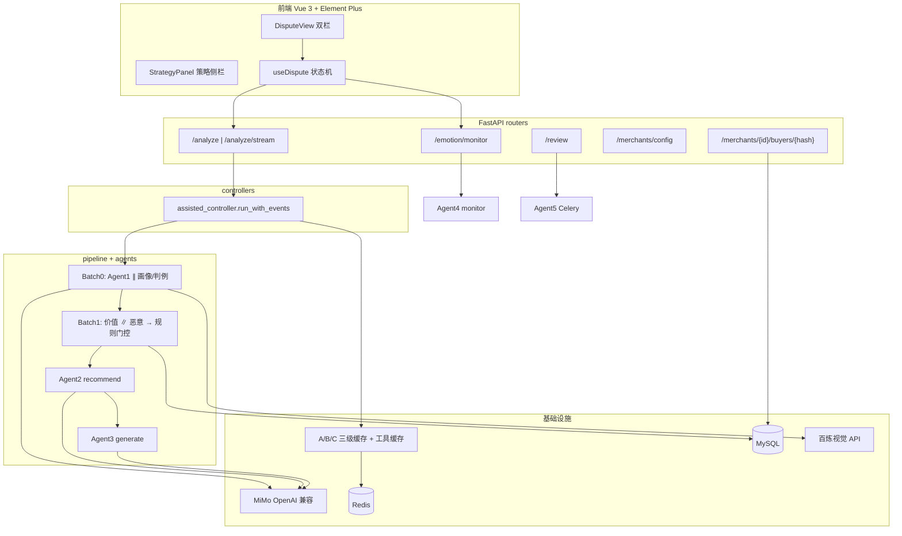
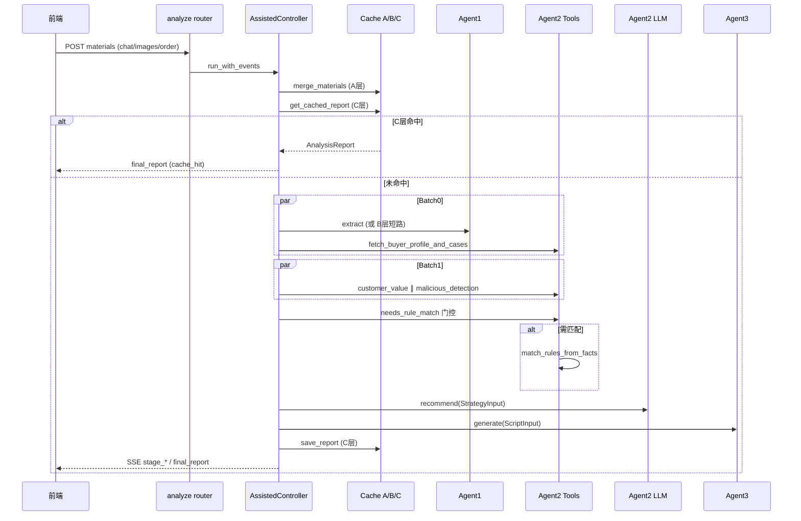
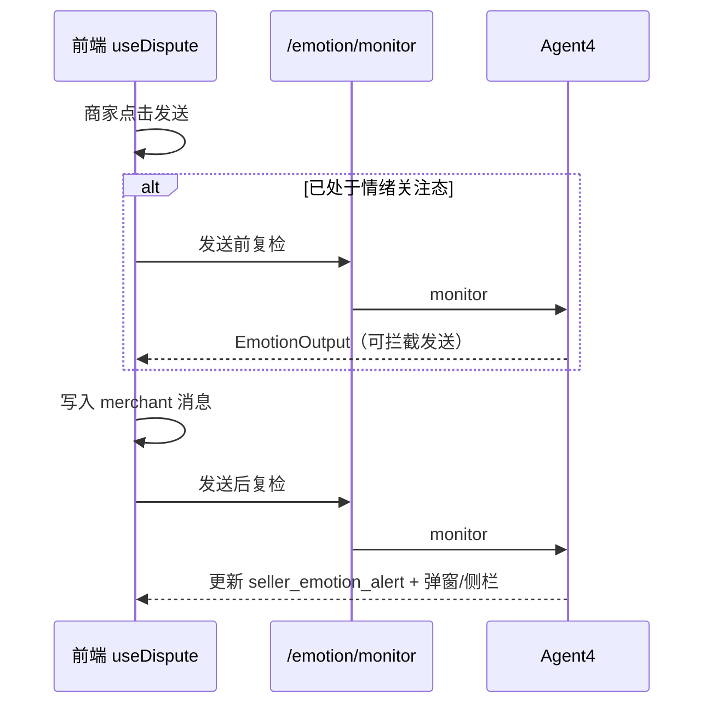

# 电商应诉助手 — 面试项目总结（代码真源版）

> 本文以 **代码实现** 为准（`schemas.py`、`assisted_controller.py`、各 Agent/Tools 模块）。`docs/modules/` 等设计文档可能滞后，面试讲解以本文与代码一致。

---

## 一、一句话定位

面向电商中小商家的 **售后纠纷 AI 应诉助手**：商家与买家人工对话，AI 侧边栏实时输出 **事实摘要 → 策略建议 → 可发送话术**，降低「不懂规则、举证无效、情绪化让步」带来的损失。

**当前可演示范围**：

- **主链路（`/analyze`）**：辅助模式 assisted，Agent1→2→3 端到端可跑
- **旁路 API**：卖家情绪 `POST /emotion/monitor`（Agent4，前端发消息时已集成）；纠纷复盘 `POST /review`（Agent5 + Celery，API 已就绪，纠纷页关闭入口待接）
- **未实现**：智能模式（AI 代聊）、平台物流真实 API

---

## 二、架构总览

### 2.1 分层结构



### 2.2 五 Agent 职责与接入状态

| Agent | 模块 | 职责 | 主链路 |
|-------|------|------|--------|
| Agent1 事实还原 | `agent1/fact_extractor.py` | 文本+视觉+物流 → 结构化事实、争议框架、规则导航计划 | ✅ |
| Agent2 策略参谋 | `agent2/strategist.py` | 综合判责、处置方向、动作契约、方案空间 | ✅ |
| Agent3 话术生成 | `agent3/script_generator.py` | 在契约约束下生成店主口吻话术 | ✅ |
| Agent4 卖家情绪 | `agent4/emotion_monitor.py` | 卖家消息情绪分析 + 强/轻度预警 | ⚡ 独立 API，非 analyze 内嵌 |
| Agent5 复盘分析 | `agent5/reviewer.py` + Celery | 纠纷关闭后提炼判例入库 | ⚡ `POST /review` 异步入队 |

**协作原则**（`schemas.py` 文件头注释）：所有 Agent 输入输出 **必须引用全局契约**，禁止自造字段；Agent 间通过 Pydantic 模型传递，可单测、可评测对齐。

### 2.3 核心处理链路（`assisted_controller.run_with_events`）



**阶段事件**（流式）：`stage_start` → `stage_done`（含 `partial_report`）→ `stage_delta`（Agent2 reasoning）→ `final_report` → `pipeline_done`。

### 2.4 API 端点一览（`backend/main.py`）

| 方法 | 路径 | 处理器 | 说明 |
|------|------|--------|------|
| GET | `/health` | `health_check` | 健康检查 |
| POST | `/analyze` | `assisted_run` | 同步分析，返回 `AnalysisReport` |
| POST | `/analyze/stream` | `analyze_stream` | SSE 流式（`ENABLE_ANALYZE_STREAM=1`） |
| POST | `/emotion/monitor` | `emotion_monitor` | 卖家发消息前后情绪把关（Agent4） |
| POST | `/review` | `close_dispute_review` | 结束纠纷，可选 Celery 复盘入库（Agent5） |
| GET/PUT | `/merchants/config` | 默认商家配置 | 仅 `assisted` 合法 |
| GET/PUT/DELETE | `/merchants/{id}/buyers/{hash}` | 买家画像 CRUD | buyer_id 为哈希 |

### 2.5 卖家情绪旁路（与主链路解耦）



**设计要点**：监控对象是**卖家**（防情绪化让步/激化），不是买家；`AnalysisReport.emotion_alert` 字段保留但主链路不写，实时预警走独立 API + 前端 `seller_emotion_alert` 状态。

### 2.6 纠纷复盘旁路（Agent5）

```
POST /review（save_to_db=true）
  → review_controller.submit_review
  → 从 A/C 缓存组装 full_timeline
  → Celery async_review → agent5.review → save_case_to_db
  → clear_dispute_cache
```

前置：须先完成至少一次 `/analyze`，否则无 materials/report 缓存。

---

## 三、功能点清单（代码已实现）

### 3.1 产品与交互

| 功能 | 实现位置 | 说明 |
|------|----------|------|
| 辅助模式双栏 UI | `DisputeView.vue` + `ChatPanel` + `StrategyPanel` | 左对话、右 AI 分析 |
| 多轮材料增量合并 | `cache/materials_store.merge_materials` | 同 dispute_id 累积 chat/images |
| 快照覆盖 / 重置上下文 | `analyze` 请求参数 | `reset_context` 清 A/B/C 缓存 |
| 图片举证 | 前端 data URL → Agent1 `analyze_image` | 最多并行 3 张 |
| 一键填入话术 | `useDispute.apply_script` | 将推荐话术写入输入框 |
| SSE 流式进度 | `routers/analyze.analyze_stream` | `ENABLE_ANALYZE_STREAM=1`；可 HTTP 降级 |
| Agent2 推理增量展示 | `reasoning_delta_callback` | 前端实时拼接策略推理 |
| 卖家情绪监控 | `useDispute` + `POST /emotion/monitor` | 发送前拦截/发送后预警；`EmotionAlert` + `SellerEmotionDialog` |
| 纠纷复盘 API | `api/index.js` → `POST /review` | 后端 + Celery 就绪；纠纷页「结束纠纷」UI 待接 |
| 商家配置 | `routers/merchants` | `mode=assisted`、`auto_threshold`（后者未驱动自动化） |
| 买家画像 CRUD | `routers/buyers` | 按 merchant_id 隔离，buyer_id 为哈希 |

### 3.2 智能决策能力

| 能力 | 关键模块 | 要点 |
|------|----------|------|
| 多模态事实提取 | `fact_extractor.py` | LLM 文本 + 视觉 + 物流占位 |
| 主争议框架单点判定 | `dispute_frame.resolve_primary_dispute_frame` | 七天无理由/质量/描述不符/物流；下游只读 |
| 证据质量 & 可决策度 | `FactOutput.evidence_quality` / `decision_readiness` | 驱动策略阶段与金额门禁 |
| 规则导航计划 | `agent1/rule_plan.py` | Agent1 锁定 doc/通道/检索词，Agent2 执行匹配 |
| 规则匹配引擎 | `rule_matcher.py` + `rule_lexicon.py` | doc 锁定 → 节过滤 → LLM 条文选型 → must/should |
| 简单案规则跳过 | `agent2_tools.needs_rule_match` | 降本：无品类通道、低恶意、单诉求、无价值通道 |
| 买家画像 & 相似判例 | `agent2_tools` + MySQL | 缓存 + 默认画像兜底 |
| 客户价值双通道 | `evaluate_customer_value` | 长期价值 / 本单价值，触发 `long_term`/`order` 通道 |
| 恶意行为双轨检测 | `detect_malicious_behavior` | 硬规则信号 + LLM 语义，融合 risk_level |
| 策略 LLM + 责任归属 | `strategist.recommend` | disposition / responsibility / win_rate |
| **动作契约 ActionContract** | `strategist._infer_action_contract` | 6 种 action_type、4 种 compensation_policy |
| **方案空间 ResolutionContract** | `resolution_contract.infer_resolution_contract` | offered/forbidden modes、验收门禁、具体补偿额 |
| 话术生成 + 质量门禁 | `agent3_tools.generate_buyer_script` | 禁套话/踢皮球/人机味/过早亮规则/方案越界等 |
| 卖家情绪分析 | `agent4_tools.analyze_seller_emotion` | LLM 语义 + 关键词降级；强/轻度双阈值预警 |
| 纠纷复盘卡片 | `agent5_tools.generate_review_card` | 从 full_timeline 提炼 lesson + 入库判例 |
| 配置化文本信号 | `data/text_signals.json` | 全品类词表，避免硬编码分支 |
| 规则数据管线 | `scripts/crawl_*` + `import_rules_*` | 爬取 → MySQL → 词表构建 |

### 3.3 工程与质量保障

| 能力 | 位置 |
|------|------|
| 三级纠纷缓存 A/B/C | `materials_store` / `result_cache` + `fingerprint` |
| 工具层缓存 | `vision_cache`、`tool_cache`（视觉/物流/画像/判例） |
| 全局异常与结构化日志 | `main.py` 中间件 + `[Agentx]`/`[AssistedController]` 前缀 |
| 评测树批量跑批 | `eval/pipeline/run_batch_eval.py` |
| LLM-as-Judge 11 维 | `eval/content/prompts/judge_system.md` |
| 硬断言 + 防泄题 | `assert_report.py` + `spec_to_fixture.py` |
| pytest | `tests/`（约 200+ 用例，覆盖 schemas/各 Agent/API/规则/缓存） |

### 3.4 明确未实现 / 占位（面试须诚实说明）

| 项 | 状态 |
|----|------|
| **智能模式**（AI 代聊） | `controllers/` 仅 `assisted_controller`；`auto_threshold` 存库未驱动自动化 |
| **纠纷关闭 UI** | `/review` API 与 `api/index.js` 封装已有，DisputeView 未接关闭入口 |
| **平台物流 API** | `platform_api.query_logistics` 返回默认空值 |
| **AnalysisReport.emotion_alert** | 契约字段保留；主链路不写，实时预警走 `/emotion/monitor` |

---

## 四、设计思想（面试价值点）

### 4.1 契约驱动，而非 Prompt 拼接

`schemas.py`（约 560 行）是 **唯一字段真源**：枚举、输入输出、规则约束、方案模式全部集中定义。好处：

- Agent 可独立单测；评测可对结构化字段做硬断言
- 变更有迹可循，避免「各 Agent 各说各话」

### 4.2 决策与表达分离（核心创新）

两层约束解决「策略说 A、话术说 B」：

1. **ActionContract**（Agent2）：`action_type`（如 `evidence_request`）、`compensation_policy`（能否谈钱）、`next_step`、`rule_constraints`
2. **ResolutionContract**（Agent2）：`offered_modes` / `forbidden_modes`（如禁止 `refund_only`）、`require_inspection_before_refund`、`proposed_compensation_amount`

Agent3 **只做口语化**，通过 `agent3_tools` 多项门禁检测越界（如禁止仅退款承诺、验收前说「到账」）。

> 面试话术：「不是让同一个 LLM 又决策又写话术，而是把决策压成结构化契约，话术模型在契约内生成，再用代码门禁兜底。」

### 4.3 确定性优先，LLM 补语义

| 环节 | 实现方式 |
|------|----------|
| 主争议框架 | 规则 + lexicon facet 映射（`dispute_frame.py`） |
| 规则 doc/通道锁定 | Agent1 `rule_plan` + `rule_lexicon` |
| 恶意硬信号 | 配置化规则打分 |
| 客户价值 | 分项评分公式 |
| 条文选型 / 策略推理 / 话术 | LLM |

原则：**能写死的边界不写进 prompt 赌运气**；LLM 失败有模板/规则降级，不伪造成功。

### 4.4 编排层预计算，避免 Agent 内串行

`assisted_controller` 在 Batch0/Batch1 用 `ThreadPoolExecutor` 并行：

- Agent1 ∥ 画像/判例
- 客户价值 ∥ 恶意检测

结果通过 `StrategyInput.precomputed_*` 注入 Agent2，避免策略 Agent 内部重复调工具、拉长尾延迟。

### 4.5 单路径迭代

`controllers/__init__.py` 约定：智能模式后续 **独立 controller**，不与 assisted 互相导入。当前只维护一条可验证 analyze 主链路，符合「迭代即替换」工程原则。

### 4.6 主链与旁路分离

- **主链** `/analyze`：事实→策略→话术，追求低延迟与可缓存
- **旁路** `/emotion`、`/review`：按需触发，不拉长 analyze 尾延迟；Agent4 监控卖家、Agent5 在纠纷结束后异步写判例

---

## 五、业务疑难点深度剖析

### 难点 1：规则边界模糊，关键词不够用

**业务现象**：同一纠纷可能涉及七天无理由、质量、服务标、物流等多条规则交叉；条文表述覆盖多场景。

**代码方案**（分层，非一步到位）：

1. Agent1 产出 `rule_match_plan`（`target_doc_ids`、`section_selections`、检索词）— **导航而非终判**
2. `needs_rule_match` 门控：简单案跳过全文匹配，省延迟与 token
3. `match_rules_from_facts`：MySQL 加载正文 → `prepare_llm_candidates` 缩候选 → LLM 选型 → `must`/`should` 分级 → `RuleConstraint` 结构化约束

**面试追问**：为什么不让 Agent2 直接读整本规则？  
**答**：规则库体积大、噪声高；先 doc/节锁定再 LLM 选型，兼顾 recall 与上下文窗口；简单案门控避免 over-engineering。

---

### 难点 2：策略与话术一致性

**业务风险**：LLM 话术容易「过度承诺退款」「与策略阶段矛盾」「向买家亮平台对峙牌」。

**代码方案**：

- Agent2 输出 `strategy_stage`（`evidence_first` / `negotiate_settle` / …）+ ActionContract + ResolutionContract
- Agent3 prompt 显式传入契约 JSON
- `_collect_style_issues` / `_violates_resolution_contract` 代码检测，失败 **重试一次**

**可举例**：`forbidden_modes` 含 `refund_only` 时，话术出现「直接退款不退货」→ 门禁拦截。

---

### 难点 3：证据质量与「可决策度」

**业务现象**：聊天记录碎片化、图片质量参差、物流信息滞后。

**代码方案**：

- 文本 LLM 提取诉求、`intent_tags`、`defect_type`
- `_build_vision_guidance` 用诉求锚定视觉分析方向
- `pick_balanced_visual_observations` 多图轮询，避免只取首图
- 综合输出 `evidence_quality`、`decision_readiness`、`credential_trust`（视觉链路写入，下游只读）
- `decision_readiness=false` 时策略倾向 `evidence_first`，话术禁止空泛谈钱

---

### 难点 4：恶意识别 vs 误伤正常买家

**业务张力**：漏判恶意 → 商家损失；误判 → 体验与平台处罚。

**代码方案**：

- **硬规则层**：高频仅退款、调包标记、运费险滥用等 → `MaliciousSignal(source=hard_rule)`
- **LLM 语义层**：复杂话术施压、专业索赔模式
- 融合为 `risk_level` / `risk_score`；`medium+` 会触发 `needs_rule_match` 并影响策略 disposition
- 话术侧 `malicious_risk` 模式有专门门禁（如非 `defend_prepare` 不宜轻率对峙）

---

### 难点 5：客户价值与商家利益的权衡

**业务场景**：高 CLV 老客 vs 本单大额订单 vs 新客基线。

**代码方案**：

- `long_term_score`（画像驱动）与 `order_score`（本单金额+视觉严重度）双通道
- `channel` 为 `long_term`/`order`/`none`；触发规则匹配门控与补偿 uplift 建议
- 策略 LLM 输入含 `similar_cases` 判例，避免纯公式僵化

---

### 难点 6：全品类复用，禁止单品类硬编码

**工程约束**（`.cursor/rules`）：禁止只匹配服饰等窄场景。

**代码体现**：

- `data/rule_match_lexicon.json` + `rule_lexicon_config.json` 品类/通道/facet 映射
- `data/text_signals.json` 统一信号词
- `dispute_frame` 通过 `intent_to_facets` 归一，非写死品类名

---

### 难点 7：LLM 非确定性下的质量保障

**问题**：单元测试无法覆盖「策略是否合理」。

**代码方案**：

- **评测树**：`eval/content/scenarios/` 下 functional（phase1~3）+ pilot/legacy，按轴分组（恶意/商责/协商/价值/判例/多步等）
- **流水线**：Markdown 叙事 → `scenario_gen` → fixture → 全链路 `assisted_run` → 硬断言 → Judge
- **11 维 Judge** + **硬失败**（提前承诺、事实冲突、编造规则等优先于总分）
- **防泄题**：`spec_to_fixture` 剥离 `expectation`/`forbidden_outputs` 等 Judge 专用字段

---

### 难点 8：性能与体验（流式 + 缓存）

**场景**：商家反复点开同一纠纷、材料微增。

| 层级 | 内容 | 失效 |
|------|------|------|
| A | 原始 materials 合并 | 指纹变 / reset_context |
| B | Agent1 `FactOutput` | materials 指纹变 |
| C | 完整 `AnalysisReport` | 报告指纹变 |

C 层命中可 **跳过整条 Agent 链**；B 层命中跳过 Agent1 重跑。默认 `ENABLE_REDIS_CACHE=0` 开发走内存 fallback。

---

## 六、面试讲解脚本

### 6.1 电梯稿（约 60 秒）

「我做的是电商售后纠纷 AI 助手，服务中小商家。商家自己跟买家聊，系统在侧边栏给事实摘要、策略和可直接发送的话术。架构上是契约驱动的多 Agent：Agent1 做多模态事实和规则导航，Agent2 做策略并输出动作契约和方案空间，Agent3 只在契约里写话术，代码门禁防止过度承诺。规则匹配、恶意检测、客户价值等确定性逻辑用代码实现，LLM 负责语义推理。卖家发消息时有独立的 Agent4 情绪把关 API；纠纷结束可走 Agent5 复盘入库。还有评测树和 LLM Judge 做回归。智能代聊模式尚未实现。」

### 6.2 标准版（约 5–7 分钟）

1. **背景与痛点**（1 min）：规则复杂、举证难、情绪化让步  
2. **架构**（2 min）：五 Agent 分工 + 契约 + 编排层并行 + 三级缓存；展开 **决策/表达分离**  
3. **难点**（2 min）：规则分层匹配、证据与可决策度、恶意双轨、评测体系  
4. **结果与边界**（1 min）：辅助模式 MVP、情绪/复盘旁路 API、评测覆盖、诚实说智能模式与物流占位  

### 6.3 深挖准备（面试官常追问）

| 追问 | 答题要点 |
|------|----------|
| 为什么多 Agent 不用一个大的？ | 职责分离、可测、可替换；契约降低耦合 |
| 如何保证话术不瞎承诺？ | ResolutionContract + compensation_policy + 代码门禁 |
| 情绪为什么不做进 analyze？ | 卖家发消息才需把关；旁路 API 避免拉长主链延迟 |
| 规则从哪来？ | 爬取入库 MySQL + lexicon 索引 + 运行时匹配 |
| LLM 挂了怎么办？ | 各层有降级/模板；外部调用有重试；错误中文日志 |
| 怎么评估效果？ | 评测树 + 硬断言 + 11 维 Judge + 硬失败规则 |
| 和客服机器人区别？ | 面向 **纠纷决策** 而非 FAQ；强调规则边界与商家利益 |
| 你的贡献？ | （按个人实际填写：如契约设计、规则引擎、评测体系、门禁、编排优化等） |

### 6.4 STAR 示例（可替换为你的真实经历）

- **S**：商家在七天无理由纠纷中常被买家用「质量问题」逼退全款  
- **T**：系统需识别框架差异，避免话术错误亮质量举证或过早全额退  
- **A**：`resolve_primary_dispute_frame` 单点判定 + `FRAMES_SKIP_QUALITY_EVIDENCE_GATE` + ResolutionContract 禁止模式  
- **R**：评测场景 RULE-01/NG-03 等可回归；话术门禁拦截「验收前到账」类表述  

---

## 七、量化参考（面试前本地复核）

| 指标 | 参考值 | 核对方式 |
|------|--------|----------|
| 全局契约 | `schemas.py` ~560 行 | `wc -l schemas.py` |
| 主链路编排 | `assisted_controller.py` ~450 行 | 含 Batch0/1 并行 |
| 策略 Agent | `strategist.py` ~1100 行 | `recommend` 入口 |
| 规则匹配 | `rule_matcher.py` ~760 行 | 含 LLM 选型 |
| 评测情景 Markdown | 约 70 个（functional + pilot/legacy，含模板/README） | `eval/content/scenarios/` |
| Judge 维度 | 11 维 | `judge_system.md` |
| 动作类型 / 补偿策略 | 6 / 4 | `schemas.py` 枚举 |
| 缓存层级 | A/B/C + 工具缓存 | `backend/cache/` |
| pytest | 约 209 collected | `pytest --collect-only` |

---

## 八、关键文件速查

| 类别 | 路径 |
|------|------|
| 后端入口 | `backend/main.py` |
| 主链路 | `backend/controllers/assisted_controller.py` |
| 批处理 | `backend/pipeline/dispute_batch.py` |
| 全局契约 | `schemas.py` |
| Agent1 | `backend/agents/agent1/fact_extractor.py` |
| 争议框架 | `backend/agents/agent1/dispute_frame.py` |
| Agent2 | `backend/agents/agent2/strategist.py` |
| 方案空间 | `backend/agents/agent2/resolution_contract.py` |
| Agent3 门禁 | `backend/tools/agent3_tools.py` |
| 规则匹配 | `backend/tools/rule_matcher.py` |
| 规则门控 | `backend/tools/agent2_tools.py` → `needs_rule_match` |
| 分析 API | `backend/routers/analyze.py` |
| 情绪 API | `backend/routers/emotion.py` + `controllers/emotion_controller.py` |
| 复盘 API | `backend/routers/review.py` + `controllers/review_controller.py` |
| Agent4 | `backend/agents/agent4/emotion_monitor.py` |
| Agent5 | `backend/agents/agent5/reviewer.py` + `backend/tasks/review_task.py` |
| 前端状态 | `frontend/src/composables/useDispute.js` |
| 评测入口 | `eval/pipeline/run_batch_eval.py` |
| 深度学习编排 | `docs/interview-study-guide.md` |
| 环境模板 | `.env.example` |

---

## 九、讲解时建议强调的「能力信号」

1. **AI 工程化**：不是套 ChatGPT，而是契约 + 门禁 + 评测闭环  
2. **领域建模**：纠纷框架、规则通道、方案模式等业务抽象进 `schemas`  
3. **性能意识**：并行批处理、分级缓存、规则门控降本  
4. **诚实与演进**：清楚说明 MVP 边界（智能模式、物流占位、复盘 UI）与旁路 API 设计  

---

*文档版本：与仓库代码同步；变更时优先核对 `main.py`、`assisted_controller.py`、`schemas.py`、`useDispute.js`。*
