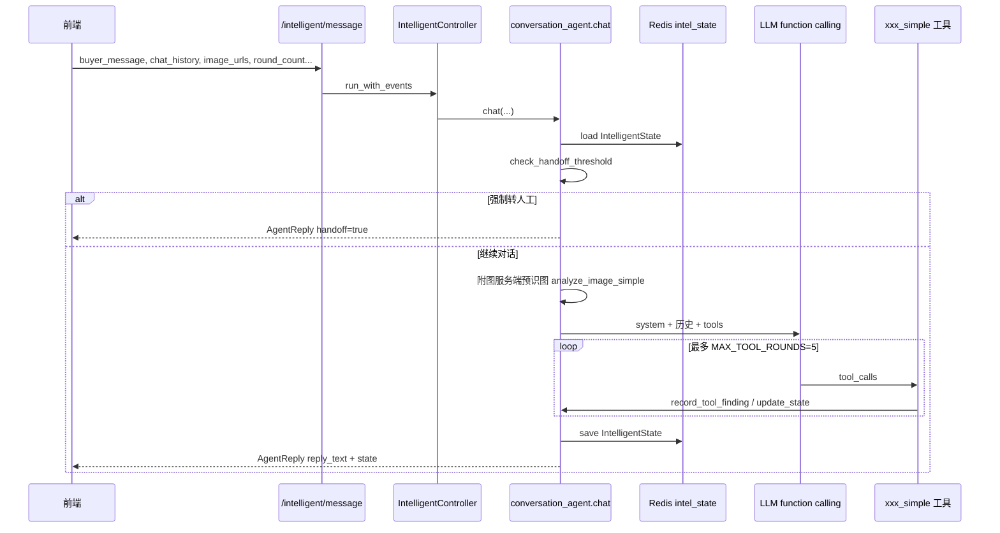

# 智能模式设计文档

## 一、定位与边界

智能模式不是「辅助模式的自动化版本」，而是**具备自主决策能力的客服主控系统**。

| 维度 | 说明 |
| ---- | ---- |
| 核心目标 | 替代人工处理大部分售后；阈值内自主对话与处置；超阈值转人工并输出交接摘要 |
| 与辅助模式关系 | **共用底层工具**（物流、视觉、规则、画像等），**不走** Agent1→2→3 管道 |
| 决策方式 | 单轮对话内 LLM + function calling 自主选工具、更新状态、生成回复 |
| 状态 | 有状态：`IntelligentState` 存 Redis，跨轮延续 |

**工程边界（仍有效）**

- 新增为主：智能模式独立模块，辅助模式核心链路不改动
- `schemas.py` 只增不改：智能模式专用类型见 `IntelligentState` / `AgentReply` 等，不改 `FactOutput` / `AnalysisReport` 语义
- 工具复用：`xxx_simple` 为轻量入口，不改变辅助模式原有函数行为
- 路由追加：`intelligent_controller.py` + `routers/intelligent.py`，在 `main.py` 注册

---

## 二、模块与文件

```
frontend/
  src/views/IntelligentView.vue      # 智能模式页面（对话 + 状态侧栏）
  src/composables/useIntelligent.js  # 会话状态、发消息、接管、模拟配置
  src/api/index.js                   # /intelligent/* HTTP 封装

backend/
  routers/intelligent.py             # API 路由
  controllers/intelligent_controller.py  # 薄控制器：校验 → chat()
  agents/conversation_agent/
    __init__.py                      # 对话主控：LLM 循环 + 工具执行
    context.py                       # IntelligentContext、Redis 读写
    prompts/system_prompt.md         # System Prompt 模板（运行时注入状态）
  tools/intelligent_tools.py         # update_state、record_tool_finding、转人工
  tools/simulation_fixture.py        # 本地联调：订单/买家模拟数据
  tools/agent1_tools.py              # analyze_image_simple
  tools/agent2_tools.py              # evaluate/detect/search *_simple
  tools/rule_matcher.py              # match_rules_simple

data/intelligent_simulation.json     # 模拟订单与买家画像（可 API 编辑）

schemas.py                           # IntelligentState、AgentReply、枚举常量
tests/test_intelligent_mode.py       # 契约与端到端 mock 测试
```

---

## 三、单轮数据流



**要点**

1. **无 Agent1/2/3 串行管道**；事实来自工具结论 + `tool_findings` 跨轮注入，而非 `FactOutput` 全量提取。
2. **附图预分析**：买家本轮 `image_urls` 在进 LLM 前由服务端逐张调用 `analyze_image_simple`，写入 `tool_findings` 并同步 `evidence_summary`，避免模型跳过识图。
3. **轮内事实累积**：同一轮多次工具调用共享 `accumulated_facts`（内存 `FactOutput`），供 `detect_malicious_simple` 等读取视觉/举证字段。
4. **对话历史**：前端每次请求带 `chat_history`（不含当前条）；后端与 Redis 状态合并后组 messages。

---

## 四、核心设计哲学

### 4.1 责任归属是策略根源

- **商责**：不扯皮，尽快善后
- **买家责任**：看画像与价值，恶意守底线
- **责任不清**：先补证，再定策略

对应 `IntelligentState.responsibility`：`merchant_fault` / `buyer_fault` / `unclear` / `mixed`。

### 4.2 局势三问 + 反思三问

运行时写在 `system_prompt.md`，每轮回复前内部完成（不展示给买家）：

**局势三问**

1. 这个买家值不值得保？
2. 这件事谁理亏，理亏多少？
3. 怎么处理对我们最有利？（长期收益最大化）

**反思三问**

1. 当前目标是什么？
2. 这样说合理吗？
3. 如果我是客户，我能接受吗？

### 4.3 个性化赔偿上限

`max_compensation`（元）：`0` 表示不限制；非零时 Agent 不得在 settlement 阶段承诺超额补偿。注入 system prompt 的 `{max_compensation}`。

### 4.4 人情世故

见 `system_prompt.md`「关于人情世故」：买家有情绪与面子；售后本质是维护商客关系；恶意要专业冷静，不对所有买家防备。

---

## 五、阶段与策略（已实现）

售后阶段以 `IntelligentState.phase` 为准，**可前进也可因新举证退回**，非固定流水线。

| phase | 含义 | 边界约束（system 动态注入） |
| ----- | ---- | --------------------------- |
| `evidence_collection` | 固定事实与举证缺口 | 缺证时不承诺退款/具体金额 |
| `strategy_negotiation` | 定方向（补证/协商/守底线） | 原则上不落地具体金额 |
| `settlement` | 在赔偿上限内给出明确方案 | 仍有缺证时应退回补证 |
| `defense` | 守底线、留痕，应对平台介入 | 冷静有据 |
| `handoff` | 交人工 | 强制/主动接管后 |

当前策略 `current_strategy`：`collect_evidence` / `negotiate` / `compensate` / `defend`。

阶段变化须 LLM 调用 `update_state` 并填写 `update_reason`。`conversation_agent` 还会按 phase 向 system 追加「本阶段操作提醒」与「可考虑工具」列表（非强制顺序）。

> 说明：早期文档中的 Connecting / Identifying / Exploring 等 CRM 阶段名为概念参考，**代码与 Prompt 均以本节 phase 枚举为准**。

---

## 六、状态管理

### 6.1 IntelligentState

```json
{
  "dispute_id": "D001",
  "phase": "evidence_collection",
  "responsibility": "unclear",
  "current_strategy": "collect_evidence",
  "strategy_rationale": "",
  "buyer_type": "normal",
  "evidence_summary": {
    "collected": ["买家举证图片（污渍）"],
    "missing": ["开箱连续视频"],
    "quality": "medium"
  },
  "risk_level": "low",
  "risk_signals": [],
  "key_decisions": [
    {"turn": 2, "decision": "先要近景再定责", "reason": "瑕疵位置不清"}
  ],
  "tool_findings": [
    {
      "tool": "analyze_image_simple",
      "turn": 1,
      "summary": "袖口有明显污渍；现象：污渍",
      "facts": {"visual_description": "...", "defect_type": "污渍", "image_index": 1}
    }
  ],
  "last_update_reason": "收到买家照片后调整策略",
  "updated_at": "2026-06-14T08:00:00+00:00"
}
```

### 6.2 更新方式

| 路径 | 触发 | 写入字段 |
| ---- | ---- | -------- |
| `update_state`（LLM 工具） | 阶段/责任/策略/风险/证据摘要变化 | phase、responsibility、evidence_summary 等 |
| `record_tool_finding`（服务端） | 任意业务工具返回后 | `tool_findings`；视觉/物流成功时联动 `evidence_summary` |

**自动证据同步**

- `analyze_image_simple` 成功 → 核销「买家举证图片」「商品实物照片」等通用缺证项；按严重度抬升 `quality`
- `query_logistics` 成功 → 记入「物流状态」，核销「物流信息」类缺证项

`tool_findings` 上限 **24** 条，超出丢弃最旧。每轮 system prompt 注入格式化后的工具事实，**勿向买家复述**。

### 6.3 存储

- **Key**：`intel_state:{dispute_id}`
- **TTL**：86400 秒（24h）
- **实现**：`context.load_state_from_redis` / `save_state_to_redis`；Redis 不可用时记录错误，不阻断单轮（状态仅当轮有效）

---

## 七、对话 Agent（conversation_agent）

### 7.1 入口

```python
def chat(
    buyer_message: str,
    *,
    dispute_id: str,
    order_id: str = "",
    order_amount: float = 0.0,
    buyer_id: str = "",
    merchant_id: str = "",
    product_category_slug: str = "",
    platform_service_tags: list[str] | None = None,
    max_compensation: float = 0.0,
    chat_history: list[ChatTurn] | None = None,
    round_count: int = 0,
    image_urls: list[str] | None = None,
    dismiss_round_handoff: bool = False,
) -> AgentReply
```

### 7.2 LLM 配置

| 项 | 值 |
| -- | -- |
| 主模型环境变量 | `CONVERSATION_AGENT_LLM_MODEL` |
| 回退模型 | `AGENT2_LLM_MODEL` |
| temperature | 0.6 |
| 最大工具轮次 | `MAX_TOOL_ROUNDS = 5` |
| 调用方式 | OpenAI 兼容 `chat_completion_assistant_message` + `tools` |

### 7.3 附图处理

1. 前端传 `image_urls`（通常为 data URL）
2. `_preanalyze_pending_images` 按序识图，`buyer_claim` 取自最近 4 条买家文字
3. system 注入「本轮附图 N 张，已预分析」；user 消息追加 `[本轮买家已附图…]` 标注
4. LLM 侧应用 `image_index`（从 1 起）解析附图，避免传超长 base64

### 7.4 模拟数据补全

`apply_simulated_order_context`：当 `data/intelligent_simulation.json` 启用且订单号命中时，自动补全 `order_amount`、`buyer_id`、`product_category_slug`、`platform_service_tags`；物流文案可走 `get_simulated_logistics_text`。

---

## 八、工具集

### 8.1 Function Calling 清单

| 工具 | 说明 | 备注 |
| ---- | ---- | ---- |
| `query_buyer_profile` | 买家画像 | 对话初期优先 |
| `analyze_image_simple` | 视觉事实 | 附图预分析后勿重复；参数用 `image_index` |
| `query_logistics` | 物流状态 | 需 `order_id` |
| `match_rules_simple` | 规则边界 | 未传品类/服务标时从 context 回填 |
| `evaluate_customer_value_simple` | 客户价值 | 让利决策参考 |
| `detect_malicious_simple` | 恶意检测 | 有疑点再调；可读 `accumulated_facts` |
| `search_similar_cases_simple` | 相似判例 | 参考 lesson/outcome |
| `update_state` | 更新案件状态 | 实质性变化时；必填 `update_reason` |

**未接入**：`analyze_sentiment`（情绪由对话与 `detect_malicious_simple` 覆盖，无独立工具）。

### 8.2 xxx_simple 入口

| 文件 | 函数 | 说明 |
| ---- | ---- | ---- |
| `agent1_tools.py` | `analyze_image_simple(image_url, buyer_claim)` | `guidance` 锚定买家诉求 |
| `rule_matcher.py` | `match_rules_simple(description, service_tags, category_slug)` | 内部最小 FactOutput |
| `agent2_tools.py` | `evaluate_customer_value_simple(...)` | 客户价值 |
| `agent2_tools.py` | `detect_malicious_simple(..., facts=...)` | 恶意检测，可带轮内累积事实 |
| `agent2_tools.py` | `search_similar_cases_simple(description, top_k)` | 透传判例检索 |

原接口已够简单、直接复用：`query_buyer_profile`、`query_logistics`。

---

## 九、转人工

### 9.1 检查时机

每轮 `chat()` 开头调用 `check_handoff_threshold`（在 LLM 之前）。

### 9.2 强制转人工（`handoff=true`）

| 条件 | 默认阈值 |
| ---- | -------- |
| 买家消息含转人工/投诉/法律途径关键词 | `HANDOFF_KEYWORDS` |
| 订单金额 | `≥ DEFAULT_AMOUNT_THRESHOLD`（500 元） |
| 高风险且买家类型为 suspicious/malicious | `risk_level=high` |

强制转人工时：`reply_text` 为空，写入 `handoff_summary`，`phase` 置为 `handoff`。

### 9.3 建议转人工（`handoff_suggested=true`）

| 条件 | 行为 |
| ---- | ---- |
| `round_count ≥ DEFAULT_HANDOFF_ROUNDS`（6）且未 `dismiss_round_handoff` | 仍返回正常 `reply_text`，前端展示「建议接管」 |

用户选择继续：`dismiss_round_handoff=true` 下次请求，跳过轮次建议。

### 9.4 商家主动接管

`POST /intelligent/takeover`：加载状态 → `phase=handoff` → 返回 `build_handoff_summary` 文本。

交接摘要含：阶段、责任、策略、证据、关键决策、最近工具事实、最近更新原因。

---

## 十、API

基路径：`/api`（经前端代理）。

| 方法 | 路径 | 说明 |
| ---- | ---- | ---- |
| POST | `/intelligent/message` | 主对话入口，返回 `AgentReply` |
| POST | `/intelligent/takeover` | 商家接管 + 交接摘要 |
| GET | `/intelligent/status/{dispute_id}` | 查询 Redis 中的 `IntelligentState` |
| GET | `/intelligent/simulation` | 读取模拟配置 |
| PUT | `/intelligent/simulation` | 保存模拟配置 |

### AgentReply 字段

| 字段 | 说明 |
| ---- | ---- |
| `reply_text` | 面向买家的回复（强制转人工时为空） |
| `state` | 最新 `IntelligentState` |
| `state_updated` | 本轮是否发生状态变更 |
| `handoff` | 是否强制转人工 |
| `handoff_suggested` | 是否建议转人工（可继续对话） |
| `handoff_reason` | 原因文案 |
| `handoff_summary` | 强制转人工时的交接摘要 |
| `tools_called` | 本轮工具名列表 |

### IntelligentMessageRequest 主要字段

`dispute_id`、`buyer_message`、`order_id`、`order_amount`、`buyer_id`、`merchant_id`、`product_category_slug`、`platform_service_tags`、`max_compensation`、`chat_history`、`round_count`、`image_urls`、`dismiss_round_handoff`。

---

## 十一、前端

- **页面**：`IntelligentView.vue` — 左栏对话，右栏纠纷参数、案件状态、模拟配置
- **状态**：`useIntelligent.js` 模块级 ref，切路由保留会话
- **发送**：买家消息 + 可选附图（data URL）；`build_chat_history()` 排除当前条
- **回复展示**：`split_reply_to_chunks` 按句号/问号拆多气泡
- **接管**：转人工后 `is_input_locked`，仅可重置或查看摘要
- **轮次**：本地 `round_count`，每收到非 handoff 回复 +1

---

## 十二、话术与人格

人格、基调、禁止清单、阶段导航、工具指南以 **`backend/agents/conversation_agent/prompts/system_prompt.md`** 为运行时真源；本文档不重复全文。

设计要点：

- 身份：有经验的年轻店主（或助理）；温和、耐心、有担当
- 基调：耐心、积极、温和
- 禁止人机套话（「非常抱歉给您带来不便」「这边建议您」等）
- 复杂话分多句；商责主动担责；恶意时冷静留痕

---

## 十三、测试

- **单测/契约**：`tests/test_intelligent_mode.py` — 转人工阈值、`update_state`、`record_tool_finding`、工具执行、附图预分析、控制器入口
- **本地联调**：编辑 `data/intelligent_simulation.json` 或前端「模拟配置」面板；`enabled=true` 时按订单号/买家 ID 注入数据
- **Redis**：测试环境可设 `ENABLE_REDIS_CACHE=0`，状态不落库

---

## 十四、与辅助模式对比

| 维度 | 辅助模式 | 智能模式 |
| ---- | -------- | -------- |
| 触发 | 商家点击「AI 分析」 | 买家每发一条消息自动处理 |
| 链路 | Agent1→2→3 一次出报告 | conversation_agent 多轮对话 |
| 状态 | Redis 材料/事实/报告三层缓存 | `intel_state` 案件状态 |
| 输出 | `AnalysisReport`（事实+策略+话术选项） | `AgentReply`（回复正文+状态） |
| 通信 | HTTP `/analyze`（可选 SSE 流式） | HTTP `/intelligent/message` |
| 商家角色 | 选手话术、自行发送 | 旁观或「接管」 |

---

## 十五、后续规划

- **WebSocket**：`Architecture.md` / `Backend_api.md` 中预留；当前 MVP 为 HTTP 拉取式，每轮由前端 POST
- **商家配置接入**：转人工金额阈值、轮次上限等现为 `intelligent_tools.py` 常量，可迁至商家配置表
- **情绪 Agent**：Agent4 未接入智能模式主链路
